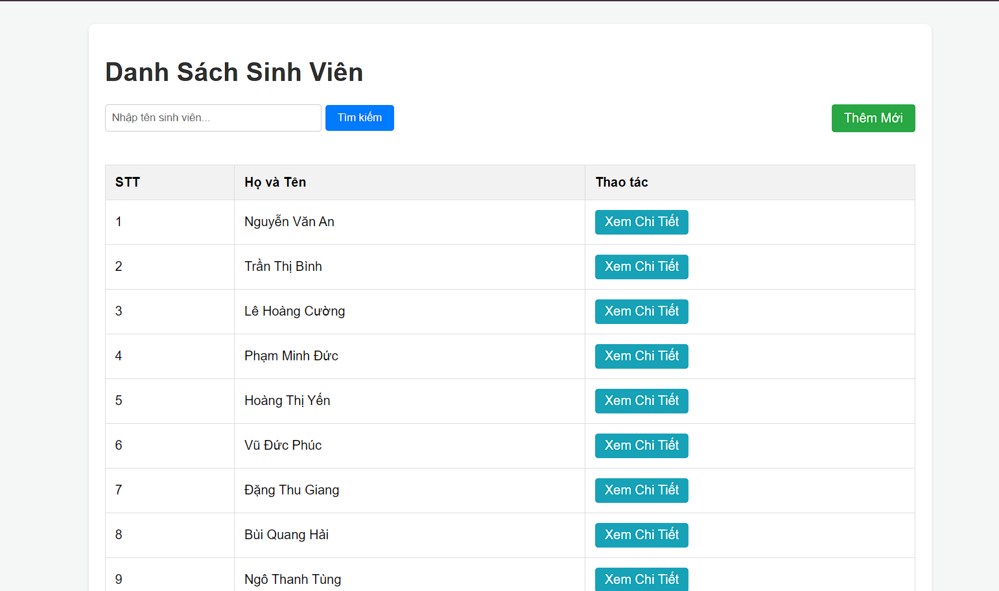
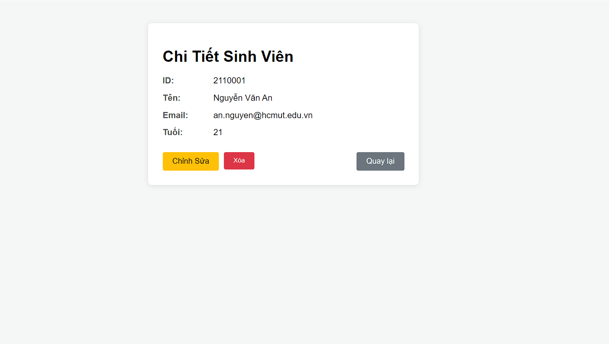
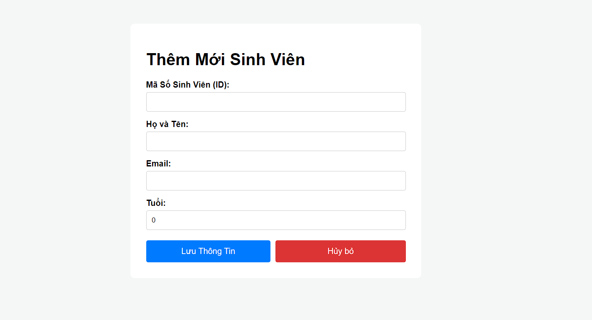
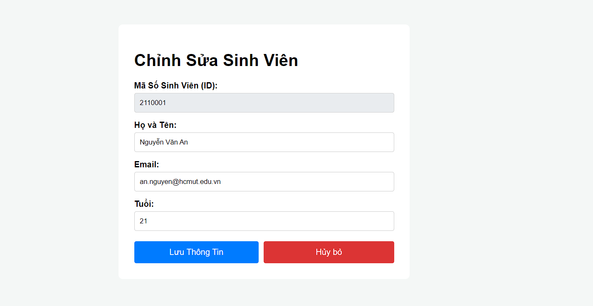

A. DANH SÁCH NHÓM

    Đỗ Quang Long - 2311896 - L02

B. URL WebService: https://students-management-xokl.onrender.com/students

C. CÁCH CHẠY DỰ ÁN

- Dự án sử dụng Spring Boot, PostgreSQL và có hỗ trợ chạy bằng Docker.

1 Chuẩn bị biến môi trường

- Tạo file .env ở thư mục gốc của dự án và điền thông tin kết nối Database:

```
DATABASE_URL=jdbc:postgresql://<HOST>:<PORT>/<DB_NAME>
DB_USER=<YOUR_USERNAME>
DB_PASSWORD=<YOUR_PASSWORD>
```

Hoặc sử dụng Neon cần thêm ?sslmode=require vào cuối URL

2 Chạy với Maven

- Cài đặt các dependency và build dự án: ./mvnw clean install -DskipTests
- Chạy ứng dụng: ./mvnw spring-boot:run

3 Chạy với Docker

- Build file .jar: ./mvnw clean package -DskipTests
- Build Docker Image: docker build -t student-management .
- Chạy Container với file .env: docker run -p 8080:8080 --env-file .env student-management

4 Truy cập ứng dụng

- Sau khi chạy thành công, truy cập tại: http://localhost:8080/students

D TRẢ LỜI CÁC CÂU HỎI LÝ THUYẾT

1. Ràng buộc Khóa Chính (Primary Key):
   • Cố tình Insert một sinh viên có id trùng với một người đã có sẵn.
   • Quan sát thông báo lỗi: UNIQUE constraint failed. Tại sao Database lại chặn
   thao tác này?

Trả lời:

- Bởi vì thuộc tính ID được thiết lập làm khóa chính. Mỗi khóa chính là duy nhất nên không thể thêm 2 sinh viên có cùng ID được.

2. Toàn vẹn dữ liệu (Constraints):
   • Thử Insert một sinh viên nhưng bỏ trống cột name (để NULL).
   • Database có báo lỗi không? Từ đó suy nghĩ xem sự thiếu chặt chẽ này ảnh hưởng gì
   khi code Java đọc dữ liệu lên?

Trả lời:

- Khi insert một sinh viên bỏ trống cột name, kết quả database vẫn cho phép insert thành công do cột name không được thiết lập ràng buộc not null.
- Điều này dẫn tới lỗi NullPointerException khi các phương thức gọi đến tên nhưng giá trị là null, hoặc các chức năng tìm kiếm theo tên sẽ lỗi hoặc thiếu chính xác.

3. Cấu hình Hibernate:
   • Tại sao mỗi lần tắt ứng dụng và chạy lại, dữ liệu cũ trong Database lại bị mất hết?

Trả lời:

- Dữ liệu cũ bị mất sau mỗi lần tắt ứng dụng hoặc chạy lại là do cấu hình spring.jpa.hibernate.ddl-auto=create. Hibernate sẽ xóa dữ liệu cũ và tạo lại bảng mới. Để dữ liệu không bị mất sau mỗi lần restart, đổi thành update hoặc none.

E CÁC MODULE TRONG LAB4





